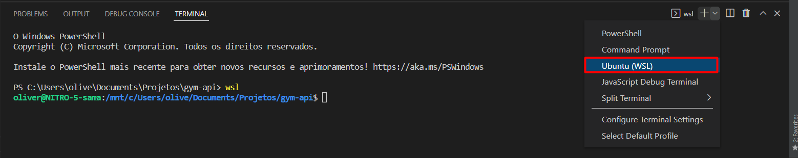

# Configurando ambiente de dev

## Sistema Operacional WINDOWS

### Habilitar o Sub-Sistema Linux para Windows
```
# Copie e cole no seu navegador o site a seguir e Siga as instruções:
  https://docs.microsoft.com/en-us/windows/wsl/install-manual
```
### Setando distribuição escolhida ao WSL
```
# Após a instalação do WSL e a escolha da distribuição Linux, em seu CMD digite o seguinte codigo seguido da Distribuicao escolhida:
  Exemplo: wsl --set-default Ubuntu
```

### Configurando terminal no PhpStorm 

```
# Para abrir o terminal linux no PHPStorm siga até as configuraçoes:
    Selecione:
         File -> Settings -> Tools -> Terminal

    e no campo "Shell path" remova o que tiver e coloque "bash.exe" sem as aspas.
```

### Configurando terminal no Vscode 

```
# Para abrir o terminal linux no Vscode, clique em terminal na parte superior:
    1ª opção:
         Após abrir o terminal na parte inferior, digite wsl e aperte enter.
         pronto, terminal linux aberto.
 
    2ª opção:
        Após abrir o terminal na parte inferior, clique no "+" no canto superior direito do terminal:
```


```
E Selecione a opção que possuir o WSL no seu texto:
```



```
Pronto, WSL configurado.
```

## Instalando Docker e Docker-compose (Agora para usúarios de Windows, Linux e MAC )

````
# Instale o docker CE(17.12+) & docker-compose(1.2+)
sudo apt-get update
sudo apt-get install docker
sudo apt-get install docker-compose

# Valide se foi instalado usansdo os seguintes comandos no terminal:
docker -v
e
docker-compose -v

# Se retornou algo diferente das vesões siga o passo a seguir:

# Copie e cole no seu navegador o site a seguir e Siga as instruções:
  https://phoenixnap.com/kb/install-docker-compose-on-ubuntu-20-04
````

## Rodando SH para Iniciar o projeto automáticamente.

````
# Em seu terminal digite:
  bash ./init-project.sh

# Responda as perguntas
# Para a chave do composer, visite o site: https://github.com/settings/tokens 
  gere uma chave e cole em seu terminal quando pedir.
````

## Iniciando projeto manualmente

``` bash
# Adicionar permissões para o docker
sudo usermod -aG docker ${USER}
sudo su - ${USER}

#Adicionando as configurações do site escolhido, digite em seu terminal: 
cp .env.example .env

# Adicionar permissão de usuário para o contéudo
sudo chown -R $USER: $USER .

# Rodar o docker-compose
sudo docker-compose up -d

# Rodar o composer
sudo docker-compose exec app composer install

# Adiconar key artisan
sudo docker-compose exec app php artisan key:generate

# Rodar as migrations
sudo docker-compose exec app php artisan migrate
```
## Acesso da api

````
http://localhost:8005
````
