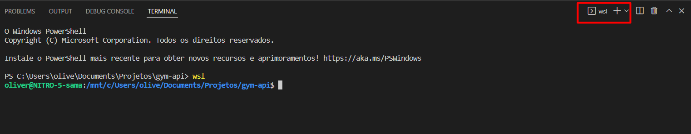

# Configurando ambiente de dev

## Sistema Operacional WINDOWS

### Habilitar o Sub-Sistema Linux para Windows
```
# Copie e cole no seu navegador o site a seguir e Siga as instruções:
  https://docs.microsoft.com/en-us/windows/wsl/install-manual
```
### Setando distribuição escolhida ao WSL
```
# Após a instalação do WSL e a escolha da distribuição Linux, em seu CMD digite o seguinte codigo seguido da Distribuicao escolhida:
  Exemplo: wsl --set-default Ubuntu
```

### Configurando terminal no PhpStorm 

```
# Para abrir o terminal linux no PHPStorm siga até as configuraçoes:
    Selecione:
         File -> Settings -> Tools -> Terminal

    e no campo "Shell path" remova o que tiver e coloque "bash.exe" sem as aspas.
```

### Configurando terminal no Vscode 

```
# Para abrir o terminal linux no Vscode, clique em terminal na parte superior:
    1ª opção:
         Após abrir o terminal na parte inferior, digite wsl e aperte enter.
         pronto, terminal linux aberto.
 
    2ª opção:
        Após abrir o terminal na parte inferior, clique no "+" no canto superior direito do terminal:
```


```
E Selecione a opção que possuir o WSL no seu texto:
```


```
Pronto, WSL configurado.
```

## Instalando Docker e Docker-compose

